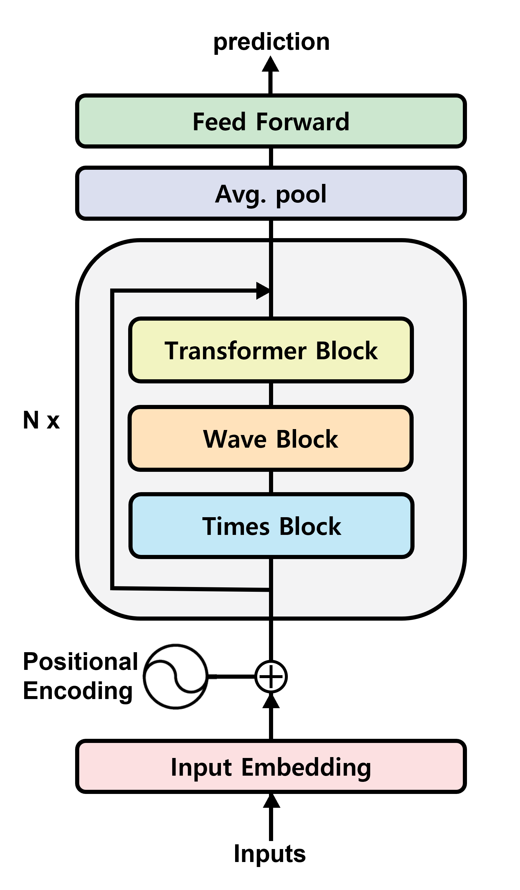

# 🌊 WaveFormer: Enhancing Long-Term Forecasting for Periodic Time Series

---

## 1. Introduction

This project aims to **improve long-term forecasting performance on periodic time series data**, inspired by the [Forecasting Sticker Sales competition](https://www.kaggle.com/competitions/playground-series-s5e1).  
The dataset consists of **7 years of sales data** across **6 countries**, **3 brands**, and **5 product categories**, and the task is to predict sales for the next **3 years**.

---

## 2. Related Work

### 2.1. Long-Term Forecasting SOTA Models

Recent state-of-the-art models for time series forecasting were developed by researchers from **Tsinghua University**.

- **[iTransformer](https://arxiv.org/abs/2310.06625)** — *Inverted Transformers Are Effective for Time Series Forecasting* (ICLR 2024 Spotlight)  
  [[GitHub](https://github.com/thuml/iTransformer)]

- **[TimeXer](https://arxiv.org/abs/2402.19072)** — *Empowering Transformers for Time Series Forecasting with Exogenous Variables* (NeurIPS 2024)  
  [[GitHub](https://github.com/thuml/TimeXer)]

These models excel in handling long-term dependencies but still struggle with strongly periodic or structured time series.

---

### 2.2. WaveNet

- **Paper:** [WaveNet: A Generative Model for Raw Audio](https://arxiv.org/abs/1609.03499)  
- **Publisher:** DeepMind, 2016  

Key components:
- **Dilated Causal Convolution (DCC):**  
  Uses exponentially increasing dilation factors in 1D convolutions to capture long-term dependencies efficiently.
- **Residual & Skip Connections:**  
  Facilitates faster convergence and enables deep architectures to learn hierarchical temporal features.

---

### 2.3. TimesNet

- **Paper:** [TimesNet: Temporal 2D-Variation Modeling for General Time Series Analysis](https://arxiv.org/abs/2210.02186)  
- **Conference:** ICLR 2023  

TimesNet converts time series into a 2D representation to better model intra-period and inter-period relations:
1. Applies Fourier Transform (FT) to find the top-K frequency components.  
2. Splits the time series into several periods based on these frequencies.  
3. Stacks the periods into a 2D tensor.  
4. Uses **2D convolutions** to capture temporal dependencies within and across periods.

---

## 3. Method

### 3.1. WaveFormer

  

**WaveFormer** combines the strengths of WaveNet and TimesNet with Transformer layers:

- **Wave Block:**  
  Adopts WaveNet’s *Dilated Causal Convolution* for efficient long-term dependency extraction.
- **Times Block:**  
  Extracts intra- and inter-period relations from TimesNet’s 2D temporal structure.
- **Transformer Block:**  
  Captures relationships among extracted features to enhance prediction robustness.

---

## 4. Experiment Plan

### 4.1. Exploratory Data Analysis (EDA)
- 6 countries × 3 brands × 5 categories = **90 time series**
- Compute meaningful statistics and seasonal patterns.

### 4.2. Missing Data Completion
- Handle missing or incomplete series using statistical methods or lightweight predictive models.

### 4.3. Baseline Model Analysis
- Evaluate **iTransformer** and **TimeXer** on the dataset.
- Investigate where these models underperform and analyze potential causes.

### 4.4. WaveFormer Evaluation
- Compare WaveFormer against baseline models.
- Test whether WaveFormer performs **better on highly periodic data**.

### 4.5. Ablation Study
- **Model Architecture**
  - Only Times Block
  - Only Wave Block
  - Both blocks (various orders and combinations)
- **Model Size**
  - Number of blocks
  - Feature dimension
- **Training Settings**
  - Sequential vs. parallel block usage
  - Hyperparameter tuning

### 4.6. (Optional) Cross-Dataset Validation
- Test on other benchmark datasets (ETT, Traffic, Weather) to analyze generalization with respect to periodicity strength.

---

## 5. Challenges & Future Work

### 5.1. Limitations
- **Extreme Long-Horizon Forecasting:**  
  When the forecast horizon exceeds 64–128, models often use bootstrapping (feeding their own outputs as future inputs). WaveFormer may handle such ultra-long forecasting more effectively.
  
- **Mixed Results:**  
  WaveFormer outperforms iTransformer on some datasets but underperforms on others. TimeXer comparison remains pending.
  
- **Benchmark Limitation:**  
  Evaluation on standard datasets like ETT or Weather remains necessary for fair benchmarking.

### 5.2. Future work

- Extend WaveFormer to handle **multi-scale periodicity**.  
- Explore **spectral attention mechanisms** for improved frequency-domain modeling.  
- Incorporate **causal inference or exogenous variables** to increase interpretability.

---

## 6. References

1. Oord, A. v. d., et al. (2016). *WaveNet: A Generative Model for Raw Audio.* arXiv:1609.03499.  
2. Wu, H., et al. (2023). *TimesNet: Temporal 2D-Variation Modeling for General Time Series Analysis.* ICLR 2023.  
3. Liu, J., et al. (2024). *iTransformer: Inverted Transformers Are Effective for Time Series Forecasting.* ICLR 2024.  
4. Liu, J., et al. (2024). *TimeXer: Empowering Transformers for Time Series Forecasting with Exogenous Variables.* NeurIPS 2024.
